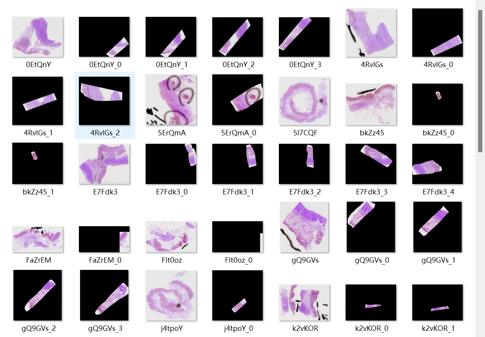
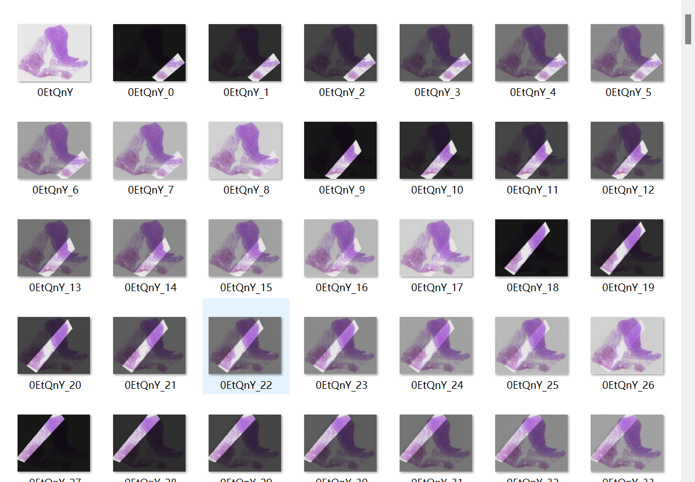

# 2022SEED第三届江苏大数据开发与应用大赛——医疗卫生赛道——杰斯的团队

本仓库记录杰斯的团队比赛相关代码

## 初赛

### 数据预处理

* kfb2svs2jpg：将kfb病理切片扫描转换为jpg图片
* svs_mask2jpg.ipynb：将svs图片按照json标注做mask保存为jpg

2022.11.18

* svs_mask2jpg.ipynb：将svs图片按照json标注做mask保存为jpg。 将 mask 后的图像与原始图像融合，融合比例 alpha 选择从 0.1 到 0.9 步长为 0.1

### 分类模型

Resnet18 作为 baseline
* 训练 notebook：resnet_baseline.ipynb
* 代码：resnet_baseline 文件夹

2022.11.18
修改notebook：resnet_baseline.ipynb 对应 train.py
* Resnet50 作为 baseline

densenet169

ConvNeXt-base
