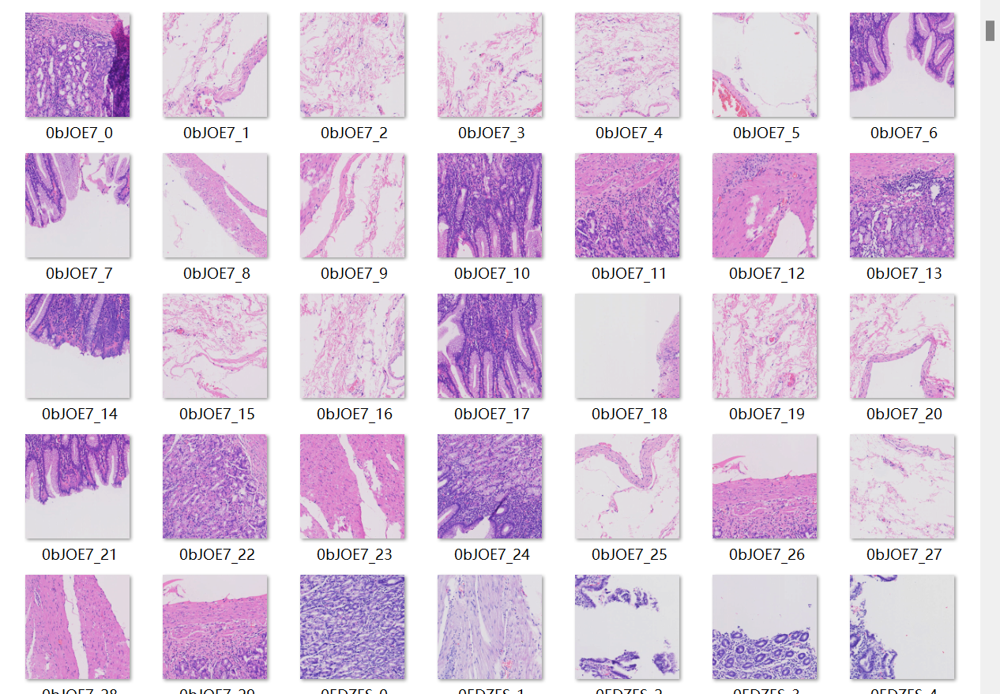
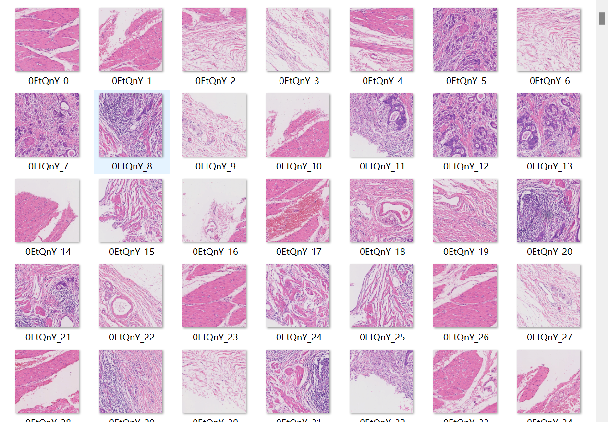
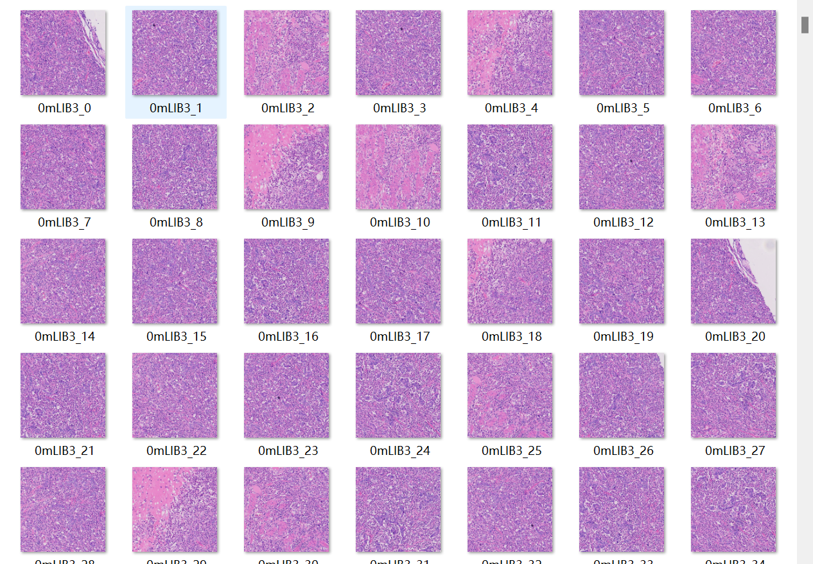
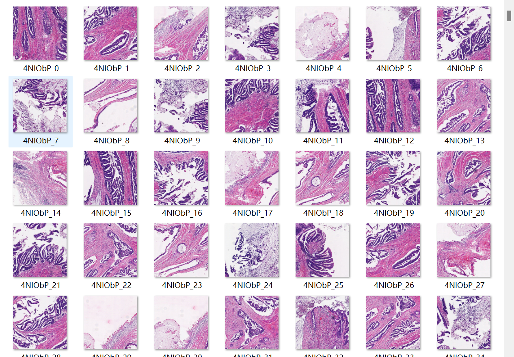
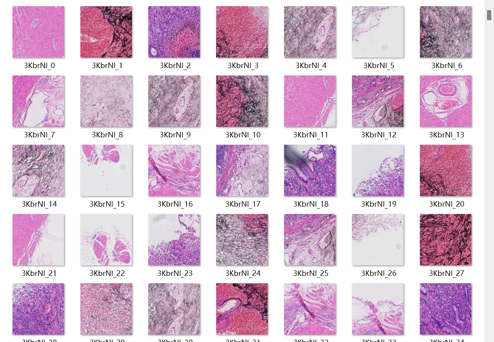
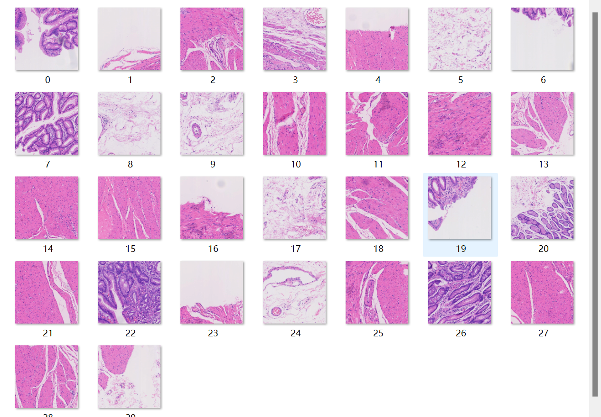

# baseline
## 数据预处理
svs level 选择 3。图片大小在 1000 X 1000 左右。

根据 json 标注提取目标区域，其他区域做 Mask。

训练数据量

T0 200

T1 76

T2 87

T3 148

Tis 99

测试数据量就是提交要求的 126

## 数据集划分

按照 0.95 ：0.05 划分训练集和验证集

## 模型选择
resnet 18 做分类

数据集尺寸 128*128

epoch 50

batch size 4

learning rate 0.0001

weight_decay 0.0001

验证集最高准确度 0.84

提交准确度 0.14

# baseline_V2
## 数据预处理

svs level 选择 3。图片大小在 1000 X 1000 左右。

根据 json 标注提取目标区域，其他区域做 Mask。

训练数据量

T0 200

T1 76

T2 87

T3 148

Tis 99

测试数据量就是提交要求的 126

## 数据集划分
按照 0.95 ：0.05 划分训练集和验证集
## 模型选择
resnet 50 做分类

数据集尺寸 512*512

epoch 15

batch size 32

learning rate 0.0001

weight_decay 0.0001

提交两版：

checkpoint-15.pth

验证集最高准确度 1

提交准确度 0.4129

checkpoint-10.pth

验证集最高准确度 0.992

提交准确度 0.5979

# densenet_baseline
## 数据预处理

patch_generate.ipynb：选取json标注框内区域生成patch。
* level：1
* 大小：512*512
* 图像区域有色部分大于0.1进行采样，否则放弃
* 每个annotation框内的采样数：
  * T0 30 T0没有标注框，随机选取位置进行采样
  * T1 T2 T3 Tis 50
  * Test  30

训练数据量

T0 5996

T1 2700

T2 2900

T3 2700

Tis 3250

测试数据量 126 *30 （30个判定结果中选择出现次数最多的）

## 数据集划分
按照 0.95 ：0.05 划分训练集和验证集

## 模型选择

densenet169 做分类

数据集尺寸 512*512

epoch 30

batch size 16

learning rate 0.0001

weight_decay 0.0001

checkpoint-26.pth

验证集最高准确度 0.961

提交准确度 0.2383

# convnext_baseline
## 数据预处理

patch_generate.ipynb：选取json标注框内区域生成patch。
* level：2
* 大小：512*512
* 图像区域有色部分大于0.1进行采样，否则放弃
* 每个annotation框内的采样数：
  * T0 40 T0没有标注框，随机选取位置进行采样
  * T1 T2 T3 Tis 40
  * Test  40

训练数据量

T0 8000

T1 2160

T2 2320

T3 2160

Tis 2600

测试数据量 126 *40 （40个判定结果中选择出现次数最多的）

## 数据集划分
按照 0.95 ：0.05 划分训练集和验证集

## 模型选择

convnext-base 做分类

数据集尺寸 512*512

epoch 50

batch size 8

learning rate 0.0005

weight_decay 0.05

验证集最高准确度 0.997

提交准确度 0.8059